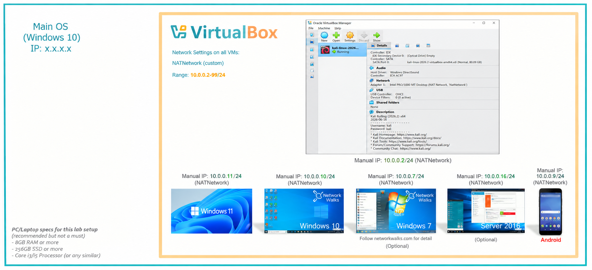
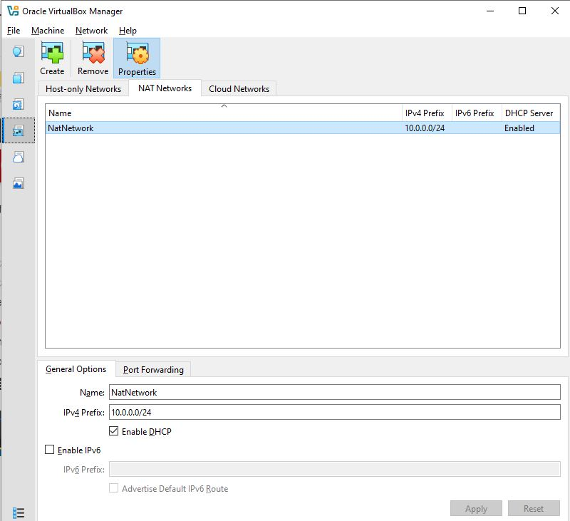
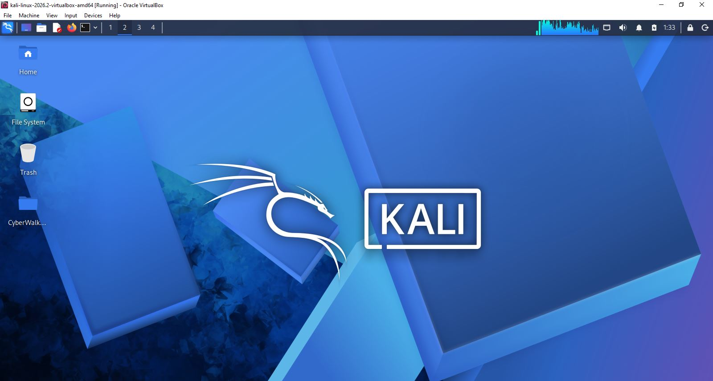
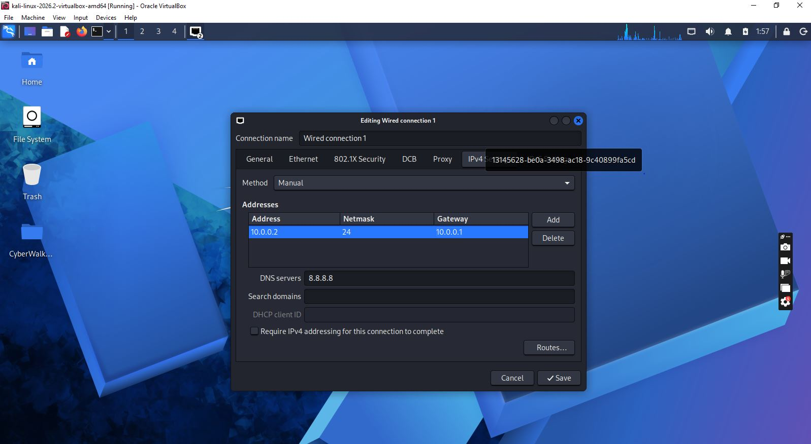

# NETWORKWALKS-ADEDUROTIMI-BO83-WK1-PM1-CYBERSECURITY-LAB-SETUP

# 🔐 Isolated Cybersecurity & Penetration Testing Lab

A controlled VirtualBox-based cybersecurity laboratory built with Kali Linux and a dedicated NAT Network for authorized penetration testing, network reconnaissance, vulnerability assessment, and security experimentation.


*High-level view of the lab: Windows 10 host running VirtualBox, with Kali Linux and future target machines connected to a shared NAT Network.*

---

## 📌 Project Overview

This project documents the design and configuration of an isolated virtual cybersecurity laboratory using Oracle VirtualBox and Kali Linux.

The objective is to establish a controlled and repeatable environment where cybersecurity tools and techniques can be safely practiced without directly exposing test systems to an uncontrolled production network.

The laboratory uses a dedicated VirtualBox NAT Network to provide network connectivity between participating virtual machines while maintaining separation from the host's primary network environment.

The architecture is designed to support the future addition of multiple attacker, target, server, client, and mobile virtual machines for authorized security testing.

---

## 🎯 Objectives

The primary objectives of this laboratory are to:

- Install and configure Oracle VirtualBox as the virtualization platform.
- Deploy Kali Linux as the primary security-testing virtual machine.
- Create a dedicated VirtualBox NAT Network for the laboratory.
- Configure IPv4 networking for the virtual machines.
- Establish consistent addressing for laboratory systems.
- Verify Layer 3 connectivity and DNS resolution.
- Validate the availability of essential security-testing tools.
- Create a clean VM snapshot for configuration recovery.
- Establish a reusable environment for future penetration-testing exercises.
- Document the configuration, verification procedures, issues, and resolutions.

---

## 🛡️ Laboratory Purpose

The laboratory provides a controlled environment for cybersecurity education, experimentation, and authorized security assessment.

Potential activities include:

- Network reconnaissance
- Host discovery
- Port and service enumeration
- Vulnerability assessment
- Packet analysis
- Web application security testing
- Exploitation practice
- Security-tool experimentation
- Network configuration analysis
- Defensive security testing

The environment can subsequently be expanded with intentionally vulnerable or test-purpose systems to simulate realistic attack-and-defense scenarios.

> ⚠️ **Ethical Use:** All penetration-testing and security-testing activities must be performed only against systems that you own or have explicit authorization to assess. The tools and techniques in this laboratory must not be used against unauthorized systems.

---

## 🏗️ Lab Architecture

The laboratory is built around Oracle VirtualBox running on a Windows host operating system.

The primary security-testing system is a Kali Linux virtual machine, connected to a dedicated VirtualBox NAT Network.

The initial network architecture uses:

```
                    ┌──────────────────────────────┐
                    │        Host Computer         │
                    │          Windows 10          │
                    │          IP: x.x.x.x         │
                    └──────────────┬───────────────┘
                                   │
                         Oracle VirtualBox
                                   │
                    ┌──────────────▼───────────────┐
                    │       NAT Network            │
                    │         NatNetwork           │
                    │       10.0.0.0/24            │
                    └──────────────┬───────────────┘
                                   │
              ┌────────────────────┼────────────────────┐
              │                    │                    │
       ┌──────▼──────┐      ┌──────▼──────┐      ┌──────▼──────┐
       │ Kali Linux  │      │ Future VM   │      │ Future VM   │
       │ 10.0.0.2/24 │      │ 10.0.0.x/24 │      │ 10.0.0.x/24 │
       │   Attacker  │      │   Target    │      │   Server    │
       └─────────────┘      └─────────────┘      └─────────────┘
```

The configured NAT Network uses the 10.0.0.0/24 IPv4 prefix. The architecture also reserves additional addresses for future laboratory systems.

The supplied architecture diagram also illustrates the intended expansion of the laboratory with Windows 11, Windows 10, Windows 7, Windows Server 2016, Android, and other test systems connected to the same virtual network.

---

## ⚙️ Lab Configuration

| Component | Configuration |
|---|---|
| Host OS | Windows 10 |
| Host RAM | 8 GB |
| Processor | Intel Core i7 |
| Hypervisor | Oracle VirtualBox 7.2 |
| Security OS | Kali Linux 2026.2 |
| Kali RAM | 2048 MB |
| Virtual Network | NAT Network |
| Network Name | NatNetwork |
| IPv4 Network | 10.0.0.0/24 |
| Kali IPv4 Address | 10.0.0.2/24 |
| Default Gateway | 10.0.0.1 |
| DNS Server | 8.8.8.8 |
| Future VM Address Range | 10.0.0.3 – 10.0.0.99 |

The VirtualBox configuration screenshot confirms the `NatNetwork` network with the IPv4 prefix `10.0.0.0/24` and DHCP enabled.

---

## 🪜 Laboratory Setup Procedure

### Step 1 — Install 7-Zip

7-Zip was installed to extract the Kali Linux virtual-machine package when distributed as a compressed `.7z` archive.

**Tool:** [7-Zip](https://7-zip.org/download.html)

### Step 2 — Install Oracle VirtualBox

Oracle VirtualBox was installed as the laboratory's virtualization platform.

VirtualBox provides the virtual hardware, networking, storage, and snapshot functionality required to construct the isolated cybersecurity environment.

### Step 3 — Create the NAT Network

A dedicated VirtualBox NAT Network named `NatNetwork` was created for the laboratory.

**Network Configuration**
```
Network Name:     NatNetwork
IPv4 Prefix:      10.0.0.0/24
DHCP:             Enabled
IPv6:             Disabled
```

The /24 network provides the laboratory with the address space `10.0.0.0 – 10.0.0.255`, with usable host addresses available for laboratory systems.


*VirtualBox's NAT Networks manager confirming `NatNetwork` with an IPv4 prefix of `10.0.0.0/24` and DHCP enabled.*

### Step 4 — Import Kali Linux

The Kali Linux virtual machine was imported into VirtualBox.

The VM's network adapter was configured to connect to the laboratory NAT Network:

```
Adapter 1
Attached to:  NAT Network
Network:      NatNetwork
Adapter Type: Intel PRO/1000 MT Desktop
```

The virtual machine was allocated:

```
RAM: 2048 MB
```

A shared folder was also configured to facilitate controlled file transfer between the Windows host and the Kali virtual machine.


*Kali Linux 2026.2 running as a VirtualBox guest, confirming a successful import and boot.*

### Step 5 — Configure Kali Linux Networking

The Kali Linux network configuration was verified and configured for consistent IPv4 addressing.

**IPv4 Configuration**
```
IP Address:    10.0.0.2
Subnet Mask:   255.255.255.0
Gateway:       10.0.0.1
DNS Server:    8.8.8.8
```

The resulting CIDR representation is `10.0.0.2/24`.

A consistent address simplifies laboratory documentation and makes it easier to reference the Kali system during subsequent exercises.


*Manual IPv4 settings on "Wired connection 1" — address `10.0.0.2/24`, gateway `10.0.0.1`, DNS `8.8.8.8`.*

> **Configuration Note:** Because DHCP is enabled on the NAT Network, a manually assigned address should be managed carefully to avoid an address collision with a DHCP lease. For a production-quality lab, either reserve the address appropriately or maintain a clearly defined static-addressing strategy.

### Step 6 — Capture a Clean VM Snapshot

After completing the initial operating-system and network configuration, a VirtualBox snapshot was created.

**Example:** `Clean Kali - Network Setup`

The snapshot represents the laboratory's known-good baseline.

If a future penetration-testing exercise modifies, corrupts, or otherwise destabilizes the Kali environment, the VM can be reverted to this baseline rather than rebuilding the system from scratch.

---

## 🔎 Lab Verification

The environment was validated using basic network and security-tool checks.

| Verification | Command | Expected Result |
|---|---|---|
| IPv4 configuration | `ip a` | `10.0.0.2/24` displayed |
| Gateway connectivity | `ping 10.0.0.1` | Successful replies |
| External connectivity | `ping 8.8.8.8` | Successful replies |
| DNS resolution | `nslookup networkwalks.com` | Domain resolves |
| Nmap installation | `nmap --version` | Nmap version displayed |
| Snapshot recovery | Restore snapshot → `ip a` | Baseline configuration restored |

**Expected Network State**
```
Kali IP:  10.0.0.2/24
Gateway:  10.0.0.1
DNS:      8.8.8.8
```

---

## 🐞 Problems Encountered & Resolutions

### Problem 1 — Internet Connectivity After Static IP Configuration

After manually configuring the IPv4 parameters, network connectivity may fail depending on the Kali Linux and NetworkManager configuration.

One workaround used during the configuration process was:

```bash
sudo nmcli connection modify "Wired connection 1" ipv4.dad-timeout 0
```

The network connection was subsequently restarted and connectivity was tested again.

> **Important:** NetworkManager connection names are system-dependent. The actual connection name should be identified before modifying it with `nmcli`.

### Problem 2 — VirtualBox VT-x / Hardware Virtualization Error

The Kali VM initially failed to start because hardware virtualization was disabled in the system firmware.

The issue was resolved by:

1. Restarting the computer.
2. Entering the BIOS/UEFI configuration.
3. Enabling Intel VT-x / hardware virtualization.
4. Saving the configuration.
5. Restarting the system.
6. Launching the Kali Linux VM.

The VM subsequently started successfully.

---

## 🧠 Technical Concepts Demonstrated

**1. Virtualization**
Virtualization allows multiple isolated operating-system environments to execute on a single physical host. In this laboratory, VirtualBox provides the virtualization layer through which Kali Linux and future target machines can operate independently.

**2. NAT vs NAT Network**
A standard VirtualBox NAT configuration and a NAT Network are not equivalent. A NAT Network is particularly useful for a multi-VM security laboratory because multiple virtual machines connected to the same NAT Network can communicate with one another while also receiving NAT-based external connectivity. This makes the architecture suitable for future attacker-versus-target scenarios.

**3. Virtual Machine Networking**
The project demonstrates how virtual network adapters connect virtual machines to different network types and how adapter configuration determines communication between systems. Understanding this is fundamental when constructing isolated penetration-testing environments.

**4. IPv4 Addressing**
```
Network:  10.0.0.0/24
Kali:     10.0.0.2/24
Gateway:  10.0.0.1
DNS:      8.8.8.8
```
This demonstrates practical configuration and verification of IPv4 addresses, subnet masks, CIDR notation, default gateways, DNS configuration, and network connectivity.

**5. VM Snapshots**
A clean snapshot provides a known-good recovery point before conducting potentially disruptive or experimental security activities. This is particularly important in penetration-testing laboratories where tools, configurations, and test activities can modify the operating system.

**6. Technical Documentation**
The project demonstrates the importance of documenting infrastructure configuration, network topology, IP addressing, commands, verification procedures, screenshots, problems encountered, troubleshooting procedures, and recovery mechanisms. Good documentation makes a cybersecurity environment reproducible rather than dependent on undocumented configuration.

---

## 🔐 Security & Ethical Use

This laboratory is intended for education, authorized security testing, and controlled cybersecurity experimentation.

Only systems owned by the tester or systems for which explicit testing authorization has been obtained should be assessed.

The isolated nature of the laboratory is intended to reduce the risk of accidentally interacting with unauthorized systems, but isolation should still be verified before conducting potentially disruptive testing.

---

## 🔮 Future Lab Expansion

The current environment establishes the foundation for a larger cybersecurity testing range.

Future virtual machines can include:

```
Kali Linux
     │
     ▼
NatNetwork
10.0.0.0/24
     │
     ├── Windows 11
     ├── Windows 10
     ├── Windows 7
     ├── Windows Server
     ├── Linux Target
     ├── Vulnerable Web Application
     └── Other Authorized Test Systems
```

The architecture shown in the original project already anticipates multiple operating systems and additional test devices connected through the same virtual network.

This creates a foundation for progressively more advanced exercises involving:

- Network enumeration
- Vulnerability scanning
- Web application testing
- Active Directory security testing
- Windows security assessment
- Linux security assessment
- Traffic analysis
- Exploitation and post-exploitation in controlled targets
- Defensive monitoring
- Incident-response exercises

---

## 📚 What I Learned

This project strengthened my practical understanding of building and documenting a controlled cybersecurity environment. Beyond the individual setup steps, it reinforced several underlying concepts that apply to any virtual lab, not just this one:

**1. Virtualization & Virtual Machine Management**
Virtualization lets a single physical host run multiple isolated, independent operating systems side by side. Deploying and managing a VM — allocating RAM, attaching virtual disks, and configuring shared folders — is the foundation every other layer of the lab depends on.

**2. NAT vs. NAT Network**
A standard NAT adapter and a VirtualBox NAT Network are not interchangeable. A NAT Network lets every VM attached to it reach the outside world *and* communicate directly with one another, whereas plain NAT isolates each VM's traffic individually. That distinction is what makes a NAT Network the right choice for a multi-machine attacker/target lab — the machines need to see each other, not just the internet.

**3. Virtual Machine Networking**
How a VM's virtual network adapter is attached (NAT, NAT Network, Bridged, Host-only, Internal) determines what it can and can't reach. Understanding adapter types and how they map to the host's and hypervisor's networking stack is essential before wiring up more complex, multi-VM topologies.

**4. IPv4 Addressing & Static IP Configuration**
Configuring and verifying an IP address, subnet mask, gateway, and DNS server by hand — rather than relying on DHCP — builds a much clearer working knowledge of how IPv4 addressing actually functions, and why consistent addressing matters for documentation and repeatability.

**5. DNS, Gateway & Connectivity Troubleshooting**
Diagnosing "no internet after a static IP change" forced a methodical approach: check the interface, check the gateway, check DNS, check the tool causing the failure (in this case, `NetworkManager`'s IPv6 duplicate-address-detection behavior). That layered troubleshooting process — link, then gateway, then DNS — is a repeatable pattern for any connectivity issue.

**6. Hardware Virtualization**
Hypervisors depend on CPU-level virtualization extensions (Intel VT-x / AMD-V) being enabled in firmware. When a VM refuses to start, the BIOS/UEFI settings are one of the first places to check, not just the hypervisor's own configuration.

**7. VM Snapshots & Recovery**
A clean snapshot, taken *before* any risky or experimental activity, is what turns a fragile one-off setup into a reusable lab. It provides a known-good baseline to roll back to after a misconfiguration, a bad exploit attempt, or a broken tool install — instead of rebuilding from scratch.

**8. Cybersecurity Lab Design**
Designing the lab around a dedicated, addressable network (rather than just spinning up a VM) is what makes it extensible — future attacker, target, and server VMs can be dropped onto the same network without reworking the foundation.

**9. Technical Documentation**
Recording commands, configuration values, screenshots, problems, and their resolutions is what makes an environment reproducible by someone else — or by future-me — instead of depending on memory of a one-time setup.

Overall, the project reinforced a principle that applies well beyond this specific lab: a good testing environment should be **controlled, reproducible, observable, and recoverable**.

---

## 🧰 Technologies & Tools

- Oracle VirtualBox 7.2:  https://virtualbox.org/wiki/Downloads
- Kali Linux 2026.2: https://kali.org/get-kali
- Windows 10
- 7-Zip: https://7-zip.org/download.html
- NetworkManager / nmcli
- Nmap
- `ip` networking utilities
- `ping`
- `nslookup`
- VirtualBox NAT Network
- Git / GitHub

---

## 📁 Project Evidence

The repository contains documentation and screenshots demonstrating the laboratory configuration and setup process.

Example evidence includes:

- Initial laboratory architecture
- VirtualBox NAT Network configuration
- Kali Linux VM configuration
- Network configuration
- Verification results
- Troubleshooting procedures
- Snapshot configuration


---

## 👤 Author

**Adedurotimi Aderemi (TecSecurion Sentinel**

*Coding with confidence. Securing with pride.*

**LinkedIn: https://www.linkedin.com/in/adedurotimi-aderemi/**

---

  ## 📌 Project Information
**Program Name:** Cybersecurity at Networkwalks  
**Week:** 01  
**Project:** Cybersecurity & Pentesting Lab Setup  
**Repository:** GitHub

## 📌 Project Classification
- **Category:** Cybersecurity / Virtualization / Penetration Testing
- **Environment:** Isolated Virtual Laboratory
- **Primary Platform:** Oracle VirtualBox
- **Security Distribution:** Kali Linux
- **Network:** 10.0.0.0/24 NAT Network
- **Primary Security VM:** Kali Linux — 10.0.0.2/24
